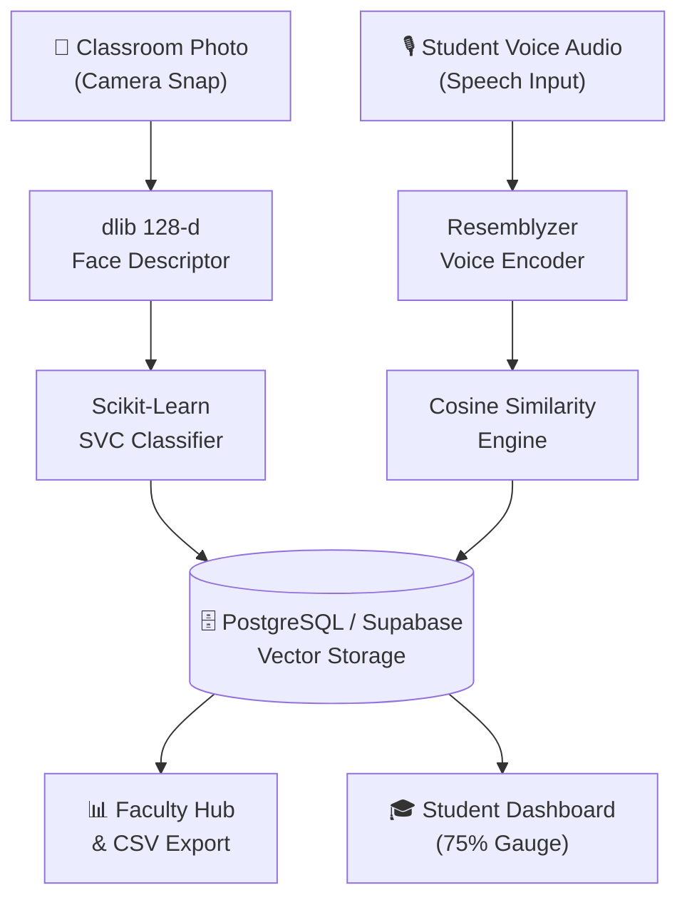

<div align="center">

# ⚡ SnapClass AI
### Next-Generation Campus Biometric Attendance & Analytics Intelligence

[](https://python.org)
[](https://streamlit.io)
[](https://supabase.com)
[](https://scikit-learn.org)
[](#)

*An enterprise-grade, privacy-first facial and multimodal voice biometric attendance automation platform engineered for universities, colleges, and high-throughput classroom environments.*

</div>

---

## 📌 Executive Overview

**SnapClass AI** replaces legacy manual roll calls, RFID cards, and biometric fingerprint queues with high-speed, instant multi-student biometric computer vision. Using **128-dimensional facial embeddings** and **deep learning speaker verification**, an instructor can record verified classroom attendance for 50+ students in under 3 seconds using a single photo.

### 🌟 Key Innovations
- **Multi-Face Batch Ingestion**: Scans multiple classroom faces concurrently from arbitrary angles and distances using `dlib` frontal feature detectors and a linear Support Vector Classifier (SVC).
- **Multimodal Voice Biometrics**: Integrated voice encoder (`resemblyzer` + `librosa`) that segments utterances ("I am present...") and computes cosine similarity match scores.
- **Dynamic QR Code Self-Enrollment**: Auto-generates unique course QR codes and invitation links (`?join-code=CS101`) for instantaneous roster population.
- **75% Regulatory Compliance Gauge**: Built-in statutory attendance tracking alerting borderline students and generating exportable CSV reports for university compliance audits.
- **Zero Raw Image Retention**: Complies with modern biometric privacy laws by transforming facial imagery into encrypted 128-dimensional floating-point vectors stored on cloud-managed Supabase PostgreSQL.

---

## 🏗️ Architecture & Tech Stack



- **Frontend / Presentation**: Streamlit (Python) with a custom Glassmorphic Design System (`Plus Jakarta Sans`, `Inter`, `JetBrains Mono`). Supports both **Clean Enterprise Light Mode (default)** and **Cyber Dark Mode**.
- **Biometric Pipelines**: `dlib`, `face_recognition_models`, `scikit-learn` (SVC), `librosa`, `resemblyzer`.
- **Database & Cloud Storage**: Supabase (PostgreSQL 15, JSONB vector embeddings, Row-Level Security).
- **Security**: Bcrypt password hashing, parameter validation, environment secrets isolation.

---

## 🚀 Quickstart & Local Setup

### 1. Clone the Repository
```bash
git clone https://github.com/Manin1311/SnapClass-AI.git
cd SnapClass-AI
```

### 2. Set Up Virtual Environment & Dependencies
```bash
python -m venv venv
# Windows:
.\venv\Scripts\activate
# Linux/macOS:
source venv/bin/activate

pip install -r requirements.txt
```

### 3. Database & Secret Configuration
Create `.streamlit/secrets.toml` (or `.env`):
```toml
SUPABASE_URL = "https://your-project.supabase.co"
SUPABASE_KEY = "your-anon-public-key"
```

Execute the database schema provided in [`supabase_schema.sql`](supabase_schema.sql) inside your Supabase project's SQL Editor.

### 4. Run Application
```bash
streamlit run app.py
```
Open **`http://localhost:8501`** in your browser.

---

## 📊 Core Features Tour

### 🎓 Faculty Command Center
- **Live KPI Counters**: Real-time aggregation of active courses, total enrolled students, and verified session logs.
- **Single-Click AI Scanner**: Upload classroom imagery or capture snaps; verify detected students before committing to the cloud.
- **Course & Roster Management**: Create sections, view class counts, and generate live QR join sheets.
- **Auditable CSV Exports**: Download complete timestamped attendance records for administrative compliance.

### 👤 Student Biometric Portal
- **One-Touch FaceID Login**: Seamless biometric sign-in without passwords.
- **Real-Time Attendance Health Meter**: Color-coded progress gauge (Green $\ge 75\%$, Amber $65-74\%$, Red $< 65\%$).
- **Course Management**: Join new classes via join codes or drop courses with single-click verification.

---

## 📄 License
Distributed under the **MIT License**. See `LICENSE` for details.